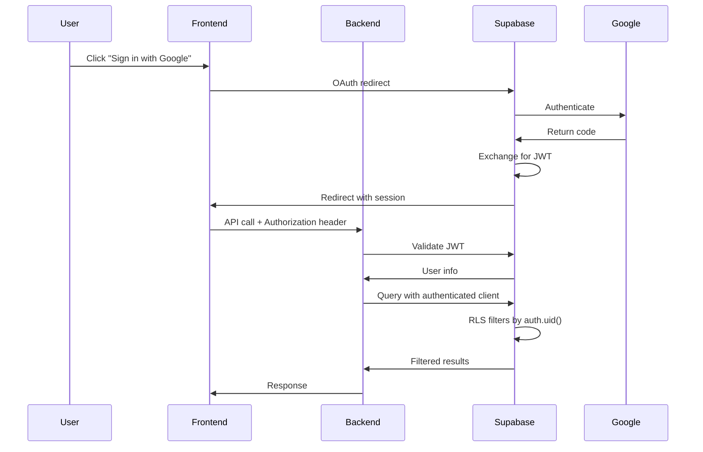

# Google OAuth + RLS Migration Guide

**Date:** January 17, 2026  
**Status:** ✅ Complete - Ready for Testing

---

## Overview

Alfred has been migrated from custom password authentication to **Supabase Auth with Google OAuth** and **proper Row Level Security (RLS)** using `auth.uid()`.

### What Changed

| Component | Before | After |
|-----------|--------|-------|
| **Authentication** | Custom password (bcrypt) | Google OAuth via Supabase Auth |
| **Sessions** | In-memory Python dict | Supabase Auth JWT tokens |
| **Database Security** | Code-level filtering | RLS policies with `auth.uid()` |
| **Client Type** | Service role key only | Authenticated client (anon key + JWT) |

---

## Setup Instructions

### 1. Google Cloud Console

1. Go to [Google Cloud Console](https://console.cloud.google.com/)
2. Create/select a project
3. Navigate to **APIs & Services > Credentials**
4. Click **Create Credentials > OAuth client ID**
5. Select **Web application**
6. Add authorized redirect URI:
   ```
   https://<your-project-ref>.supabase.co/auth/v1/callback
   ```
   (Find your exact URL in Supabase Dashboard → Authentication → Providers → Google)
7. Copy **Client ID** and **Client Secret**

### 2. Supabase Dashboard

1. Go to your Supabase project
2. **Authentication → Providers → Google**
   - Enable Google provider
   - Paste Client ID and Client Secret
3. **Authentication → URL Configuration**
   - **Site URL**: Your Railway domain (e.g., `https://your-app.railway.app`)
   - **Redirect URLs**: Add both:
     - `https://your-app.railway.app`
     - `http://localhost:5173` (for local dev)

### 3. Environment Variables

**Backend** (already configured):
- `SUPABASE_URL` ✅
- `SUPABASE_ANON_KEY` ✅
- `SUPABASE_SERVICE_ROLE_KEY` ✅

**Frontend** (add to `.env` or Railway):
```bash
VITE_SUPABASE_URL=https://<your-project-ref>.supabase.co
VITE_SUPABASE_ANON_KEY=<your-anon-key>
```

### 4. Run Database Migration

Execute the RLS migration in Supabase SQL Editor:

```bash
# Run migrations/024_rls_with_auth.sql
```

This will:
- Create RLS policies for all user-owned tables
- Set up trigger to auto-create `public.users` on sign-up
- Grant permissions to authenticated role

---

## Architecture Changes

### Request Flow



### Database Client Selection

The system automatically chooses the right client:

```python
# In request context (user-facing)
get_client() → authenticated client (respects RLS)

# Background tasks (no user context)
get_service_client() → service role (bypasses RLS)
```

### Request Context Pattern

Authentication token is passed via context variables (no threading through functions):

```python
# Set at request start
set_request_context(access_token=token, user_id=user_id)

# Used automatically by get_client()
client = get_client()  # Uses authenticated client

# Clear at request end
clear_request_context()
```

---

## Code Changes Summary

### Backend

| File | Changes |
|------|---------|
| `src/alfred/web/app.py` | Replaced password auth with JWT validation, removed in-memory sessions |
| `src/alfred/db/client.py` | Added `get_authenticated_client()`, `get_client()` auto-selects based on context |
| `src/alfred/db/request_context.py` | New: Context variables for request-scoped auth |
| `migrations/024_rls_with_auth.sql` | New: RLS policies + user provisioning trigger |

### Frontend

| File | Changes |
|------|---------|
| `frontend/src/hooks/useAuth.ts` | Rewritten: Supabase Auth integration |
| `frontend/src/components/Auth/LoginPage.tsx` | Google Sign-In button replaces email/password form |
| `frontend/src/lib/supabase.ts` | New: Supabase client initialization |
| `frontend/src/lib/api.ts` | New: Authenticated API request utilities |
| `frontend/src/components/Chat/ChatView.tsx` | Updated: Uses authenticated API |
| `frontend/package.json` | Added: `@supabase/supabase-js` |

---

## Testing Checklist

- [ ] Google OAuth redirect works
- [ ] User can sign in with Google
- [ ] `public.users` record created automatically on first sign-in
- [ ] User can access their data (inventory, recipes, etc.)
- [ ] User cannot access other users' data (RLS enforced)
- [ ] Chat endpoint works with authenticated requests
- [ ] Frontend API calls include Authorization header
- [ ] Background tasks still work (use service client)

---

## Migration Notes

### User Provisioning

When a user signs in via Google OAuth for the first time:

1. Supabase Auth creates entry in `auth.users`
2. Database trigger (`handle_new_user()`) fires
3. Creates `public.users` record with same UUID
4. Creates default `preferences` record

**No manual intervention needed** - fully automatic.

### Existing Test Users

The old test users (alice, bob, carol) are **not migrated**. They remain in the database but won't be accessible via Google OAuth. New users will get fresh UUIDs from Supabase Auth.

### RLS Policies

All user-owned tables now have RLS policies:

```sql
-- Example: inventory table
CREATE POLICY inventory_select_policy ON inventory
    FOR SELECT USING (user_id = auth.uid());
```

This means:
- Users can only see their own data
- Database enforces security (not just application code)
- Service role key bypasses RLS (for background tasks)

### Backwards Compatibility

The `get_client()` function maintains backwards compatibility:
- If access token in context → authenticated client
- Otherwise → service client (for background tasks)

This means existing code continues to work, but new user-facing code automatically gets RLS protection.

---

## Troubleshooting

### "Not authenticated" errors

- Check that `VITE_SUPABASE_URL` and `VITE_SUPABASE_ANON_KEY` are set in frontend
- Verify Google OAuth is enabled in Supabase Dashboard
- Check browser console for Supabase client errors

### RLS blocking queries

- Ensure migration `024_rls_with_auth.sql` was run
- Verify `auth.uid()` is not NULL (user is authenticated)
- Check that `user_id` column matches `auth.uid()` in policies

### User not created in `public.users`

- Check trigger exists: `on_auth_user_created`
- Verify function `handle_new_user()` exists
- Check Supabase logs for trigger errors

---

## Next Steps

1. **Test the migration** with a Google account
2. **Monitor logs** for any RLS or auth errors
3. **Update other frontend views** to use `apiRequest()` utility (optional, incremental)
4. **Remove old password auth code** once confirmed working (optional cleanup)

---

## Rollback Plan

If needed, you can temporarily rollback:

1. Revert `app.py` to use password auth
2. Revert frontend to use email/password form
3. Keep RLS policies (they're harmless if not using authenticated clients)

But the migration is designed to be **non-breaking** - old code paths still work.
