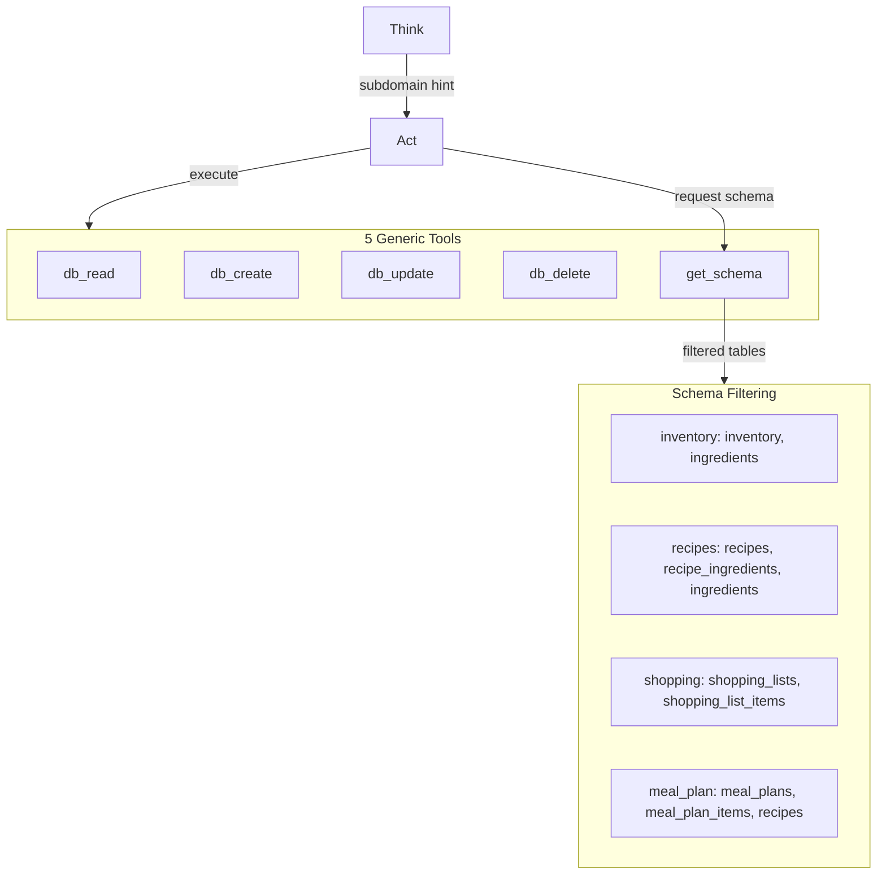
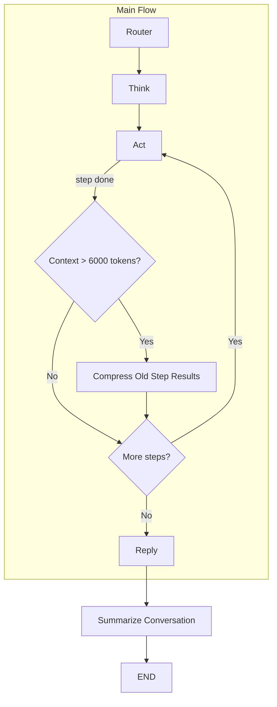

# Alfred V2 - Complete Rebuild Plan

## Design Philosophy

### Lessons Learned from v1

| Issue | What Went Wrong | v2 Solution ||-------|-----------------|-------------|| **Over-structured LLM** | 261 examples, rigid task codes | Trust the model, clear instructions, few examples || **Tool explosion** | One tool per table per action = unmaintainable | Generic CRUD primitives, subdomain filtering || **6-tier pipeline** | Manually coded what frameworks provide | Same tiers, LangGraph abstractions || **JSON file database** | Fragile, hard to query | Supabase with proper ACID transactions || **Context injection** | What stage? what functions? how much history? | On-demand retrieval, subdomain-based schema |

### What Makes Alfred V2 Magical

| Feature | Priority | How We Achieve It ||---------|----------|-------------------|| **Memory** | Critical | Vector storage + conversation history || **Cross-domain intelligence** | Critical | Shared state, CRUD can query any table || **Proactive suggestions** | Critical | Background analysis triggers || **Natural conversation** | Critical | LangGraph handles multi-turn natively || **Maintainable tools** | Critical | 5 generic tools, schema auto-generated |---

## Tool Architecture: CRUD-First Design

### The Problem with Domain-Specific Tools

If we create one tool per table per operation:

- 10 tables × 4 CRUD operations = 40 tools minimum
- Cross-table patterns (link_recipe_to_shopping, etc.) = 50-100+ tools
- Act becomes trivial (just picks the obvious tool)
- Every new pattern requires new code

### The Solution: Generic CRUD + Subdomain Filtering



---

## Schema Feeding Strategy

### Key Principle: Schema Exposure is Tiered

| Node | What It Sees | Why ||------|--------------|-----|| **Think** | Nothing about schema | Plans in natural language, outputs subdomain hints || **Act** | Only tables in assigned subdomain | Focused context, constructs CRUD calls || **Act (on request)** | Additional subdomain schema | Escape hatch if Think picked wrong subdomain |

### Think Node: No Schema, Just Intent

Think receives:

- User message
- Conversation context
- User preferences (small, always relevant)

Think outputs:

```python
class PlannedStep(BaseModel):
    description: str           # "Find recipes using eggs"
    subdomain: str             # "recipes" - hint for schema filtering
    complexity: Literal["low", "medium", "high"]
```

**Think does NOT see:** Table names, column names, or CRUD operations.

### Act Node: Subdomain-Filtered Schema

Act receives per step:

1. Step description from Think
2. Schema for the assigned subdomain only
3. Previous step results (from state cache)

**Example:** If subdomain = "recipes", Act sees:

```javascript
## Available Tables (subdomain: recipes)

### recipes
| Column | Type | Notes |
|--------|------|-------|
| id | uuid | Primary key |
| user_id | uuid | Foreign key to users |
| name | text | Required |
| cuisine | text | |
| difficulty | text | easy/medium/hard |
| prep_time_minutes | int | |
| cook_time_minutes | int | |
| servings | int | |
| instructions | text[] | |
| tags | text[] | |

### recipe_ingredients
| Column | Type | Notes |
|--------|------|-------|
| id | uuid | Primary key |
| recipe_id | uuid | Foreign key to recipes |
| ingredient_id | uuid | Foreign key to ingredients |
| name | text | Denormalized |
| quantity | numeric | |
| unit | text | |
| is_optional | boolean | |

### ingredients
| Column | Type | Notes |
|--------|------|-------|
| id | uuid | Primary key |
| name | text | Unique |
| category | text | produce, dairy, etc. |
| aliases | text[] | Alternative names |
```

Act does NOT see: inventory, shopping_lists, meal_plans (unless it requests them).

### Schema Request Safeguards

Act can request additional schemas, but with limits:

- Max 2 consecutive `request_schema` actions per step
- Requested subdomain logged for Think prompt improvement
- If Act repeatedly requests wrong schemas, it's a prompt engineering issue

---

## Maintainable Schema Generation

### Problem: Keeping Tool Schemas in Sync with Database

If we hardcode schemas in prompts:

- Schema changes require prompt updates
- Easy to forget, leads to drift
- Maintenance burden grows with tables

### Solution: Auto-Generate from Database

```python
# src/alfred/tools/schema.py

from supabase import Client

# Subdomain → table mapping (single source of truth)
SUBDOMAIN_REGISTRY = {
    "inventory": ["inventory", "ingredients"],
    "recipes": ["recipes", "recipe_ingredients", "ingredients"],
    "shopping": ["shopping_lists", "shopping_list_items", "ingredients"],
    "meal_plan": ["meal_plans", "meal_plan_items", "recipes"],
    "preferences": ["user_preferences"],
}

async def get_table_schema(client: Client, table: str) -> dict:
    """Fetch column info from Postgres information_schema."""
    result = await client.rpc("get_table_columns", {"table_name": table}).execute()
    return {
        "table": table,
        "columns": [
            {
                "name": col["column_name"],
                "type": col["data_type"],
                "nullable": col["is_nullable"] == "YES",
                "default": col["column_default"],
            }
            for col in result.data
        ]
    }

async def get_subdomain_schema(client: Client, subdomain: str) -> str:
    """Generate markdown schema for all tables in subdomain."""
    tables = SUBDOMAIN_REGISTRY.get(subdomain, [])
    schemas = [await get_table_schema(client, t) for t in tables]
    return format_as_markdown(schemas)

def format_as_markdown(schemas: list[dict]) -> str:
    """Convert schema dicts to readable markdown for LLM."""
    lines = []
    for schema in schemas:
        lines.append(f"### {schema['table']}")
        lines.append("| Column | Type | Nullable |")
        lines.append("|--------|------|----------|")
        for col in schema["columns"]:
            lines.append(f"| {col['name']} | {col['type']} | {col['nullable']} |")
        lines.append("")
    return "\n".join(lines)
```


### Postgres Function for Schema Introspection

```sql
-- migrations/004_schema_introspection.sql
CREATE OR REPLACE FUNCTION get_table_columns(table_name text)
RETURNS TABLE (
    column_name text,
    data_type text,
    is_nullable text,
    column_default text
) AS $$
BEGIN
    RETURN QUERY
    SELECT 
        c.column_name::text,
        c.data_type::text,
        c.is_nullable::text,
        c.column_default::text
    FROM information_schema.columns c
    WHERE c.table_name = get_table_columns.table_name
      AND c.table_schema = 'public'
    ORDER BY c.ordinal_position;
END;
$$ LANGUAGE plpgsql SECURITY DEFINER;
```


### Benefits

1. **Single source of truth** - Database IS the schema
2. **Zero drift** - Schema always current
3. **Easy to extend** - Add table to SUBDOMAIN_REGISTRY, done
4. **Cacheable** - Schema rarely changes, cache for session

### Caching Strategy

```python
class SchemaCache:
    """Cache schemas per session to avoid repeated DB calls."""
    
    def __init__(self, ttl_seconds: int = 300):
        self._cache: dict[str, tuple[str, float]] = {}
        self._ttl = ttl_seconds
    
    async def get(self, client: Client, subdomain: str) -> str:
        now = time.time()
        if subdomain in self._cache:
            schema, timestamp = self._cache[subdomain]
            if now - timestamp < self._ttl:
                return schema
        
        schema = await get_subdomain_schema(client, subdomain)
        self._cache[subdomain] = (schema, now)
        return schema
```

---

## Generic CRUD Tools

### Tool Definitions

```python
# src/alfred/tools/crud.py

class FilterClause(BaseModel):
    field: str
    op: Literal["=", ">", "<", ">=", "<=", "in", "ilike", "is_null"]
    value: Any

class DbReadParams(BaseModel):
    table: str
    filters: list[FilterClause] = []
    columns: list[str] | None = None  # None = all
    limit: int | None = None
    order_by: str | None = None
    order_dir: Literal["asc", "desc"] = "asc"

class DbCreateParams(BaseModel):
    table: str
    data: dict[str, Any]

class DbUpdateParams(BaseModel):
    table: str
    filters: list[FilterClause]  # Required - no accidental full-table updates
    data: dict[str, Any]

class DbDeleteParams(BaseModel):
    table: str
    filters: list[FilterClause]  # Required - no accidental full-table deletes

class GetSchemaParams(BaseModel):
    subdomain: str
```


### Implementation

```python
async def db_read(params: DbReadParams, client: Client, user_id: str) -> list[dict]:
    """Read rows from a table with filters."""
    query = client.table(params.table).select(
        ",".join(params.columns) if params.columns else "*"
    )
    
    # Always filter by user_id for user-owned tables
    if params.table in USER_OWNED_TABLES:
        query = query.eq("user_id", user_id)
    
    for f in params.filters:
        query = apply_filter(query, f)
    
    if params.order_by:
        query = query.order(params.order_by, desc=(params.order_dir == "desc"))
    
    if params.limit:
        query = query.limit(params.limit)
    
    result = await query.execute()
    return result.data

async def db_create(params: DbCreateParams, client: Client, user_id: str) -> dict:
    """Insert a new row."""
    data = {**params.data}
    if params.table in USER_OWNED_TABLES:
        data["user_id"] = user_id
    
    result = await client.table(params.table).insert(data).execute()
    return result.data[0]

async def db_update(params: DbUpdateParams, client: Client, user_id: str) -> list[dict]:
    """Update rows matching filters."""
    query = client.table(params.table).update(params.data)
    
    if params.table in USER_OWNED_TABLES:
        query = query.eq("user_id", user_id)
    
    for f in params.filters:
        query = apply_filter(query, f)
    
    result = await query.execute()
    return result.data

async def db_delete(params: DbDeleteParams, client: Client, user_id: str) -> int:
    """Delete rows matching filters. Returns count deleted."""
    query = client.table(params.table).delete()
    
    if params.table in USER_OWNED_TABLES:
        query = query.eq("user_id", user_id)
    
    for f in params.filters:
        query = apply_filter(query, f)
    
    result = await query.execute()
    return len(result.data)

def apply_filter(query, f: FilterClause):
    """Apply a single filter clause to a query."""
    match f.op:
        case "=": return query.eq(f.field, f.value)
        case ">": return query.gt(f.field, f.value)
        case "<": return query.lt(f.field, f.value)
        case ">=": return query.gte(f.field, f.value)
        case "<=": return query.lte(f.field, f.value)
        case "in": return query.in_(f.field, f.value)
        case "ilike": return query.ilike(f.field, f.value)
        case "is_null": return query.is_(f.field, None)
    return query

# Tables that are user-scoped (auto-filter by user_id)
USER_OWNED_TABLES = {
    "inventory", "recipes", "meal_plans", "shopping_lists", 
    "shopping_list_items", "user_preferences", "meal_plan_items"
}
```

---

## Tier 2: Business Logic RPCs (Future)

**Not implementing now.** Added only when we hit proven pain points.

### When to Add an RPC

| Pain Point | RPC Solution ||------------|--------------|| LLM can't compare quantities correctly | `rpc_compare_inventory(recipe_id, user_id)` || Chained queries too slow | `rpc_suggest_recipes(ingredient_ids)` || Unit conversion errors | `rpc_normalize_units(items)` || Name matching fails | `rpc_match_ingredient(name)` |

### How RPCs Slot In

```python
# Just another tool - no architecture change
class DbCallParams(BaseModel):
    function: str
    args: dict[str, Any]

async def db_call(params: DbCallParams, client: Client) -> Any:
    result = await client.rpc(params.function, params.args).execute()
    return result.data
```

Think learns: "This is a known pattern → use RPC instead of CRUD chain"---

## Orchestration Architecture

### Graph Flow

```javascript
┌────────┐   ┌───────┐   ┌──────────────────┐   ┌───────┐
│ ROUTER │──▶│ THINK │──▶│     ACT LOOP     │──▶│ REPLY │
└────────┘   └───────┘   │                  │   └───────┘
     │            │      │ • Get schema     │        │
     │            │      │ • Execute CRUD   │        │
     │            │      │ • Cache results  │        │
     │            │      │ • Loop or exit   │        │
     │            │      └──────────────────┘        │
     │            │              │                   │
     └────────────┴──────────────┴───────────────────┘
                         │
                    SHARED STATE
```


### Node Responsibilities

| Node | Purpose | Inputs | Outputs ||------|---------|--------|---------|| **Router** | Classify intent, pick agent, set complexity | User message, preferences | `{ agent, goal, complexity, context_needs }` || **Think** | Plan steps with subdomain hints | Goal, user context | `{ goal, steps[] }` with subdomain per step || **Act Loop** | Execute steps via CRUD tools | Step + subdomain schema | Tool calls until step complete || **Reply** | Synthesize user response | Execution results | Natural language response |

### Key Design Decisions

1. **Generic CRUD** - 5 tools cover all tables, Act reasons about queries
2. **Subdomain filtering** - Act only sees relevant schema per step
3. **Schema auto-generated** - From database, never stale
4. **No tool codes** - Natural language intent flows through
5. **EntityRef for tracking** - All objects have `{type, id, label, source}`

---

## Core Contracts

### Router Output

```python
class RouterOutput(BaseModel):
    agent: Literal["pantry", "coach", "cellar"]
    goal: str  # Natural language
    complexity: Literal["low", "medium", "high"]
    # NOTE: No context_needs - Act handles ALL data access via CRUD
```


### Think Output

```python
class PlannedStep(BaseModel):
    description: str           # "Find recipes using available ingredients"
    subdomain: str             # "recipes", "inventory", etc.
    complexity: Literal["low", "medium", "high"] = "low"

class ThinkOutput(BaseModel):
    goal: str
    steps: list[PlannedStep]
```


### Act Loop Actions

```python
ActionType = Literal["tool_call", "step_complete", "request_schema", "ask_user", "blocked", "fail"]

class ToolCallAction(BaseModel):
    action: Literal["tool_call"]
    tool: Literal["db_read", "db_create", "db_update", "db_delete"]
    params: dict  # Tool-specific params

class StepCompleteAction(BaseModel):
    action: Literal["step_complete"]
    result_summary: str
    data: Any  # Full result for caching

class RequestSchemaAction(BaseModel):
    action: Literal["request_schema"]
    subdomain: str  # Request additional subdomain schema

class BlockedAction(BaseModel):
    action: Literal["blocked"]
    reason_code: Literal["INSUFFICIENT_INFO", "PLAN_INVALID", "TOOL_FAILURE"]
    details: str
    suggested_next: Literal["ask_user", "replan", "fail"]
```


### Entity Reference Pattern

```python
class EntityRef(BaseModel):
    type: str      # "ingredient", "recipe", "meal_plan"
    id: str        # UUID
    label: str     # Human-readable for LLM context
    source: str    # "db_lookup", "user_input", "generated"
```

---

## State Management

### AlfredState

```python
class AlfredState(TypedDict, total=False):
    # Input
    user_id: str
    user_message: str
    
    # Router output
    agent: str
    goal: str
    complexity: str
    context_needs: list[str]
    
    # Think output
    planned_steps: list[PlannedStep]
    current_step_index: int
    
    # Act state
    step_results: dict[int, Any]  # Cache of tool outputs by step
    current_schema: str           # Active subdomain schema
    
    # Conversation context
    conversation: ConversationContext
    
    # Output
    final_response: str
    error: str | None
```


### Conversation Context Structure

```python
class ConversationContext(TypedDict):
    # High-level summary of current engagement
    engagement_summary: str  # "Helping with meal planning, saved 2 recipes..."
    
    # Last 2-3 exchanges - full text
    recent_turns: list[dict]  # [{user: str, assistant: str, timestamp: str}]
    
    # Older exchanges - compressed
    history_summary: str  # "Earlier discussed pasta, added milk to pantry..."
    
    # Tracked entities for "that recipe" resolution
    active_entities: dict[str, EntityRef]
```


### Aligned Caching Strategy

Step results and conversation history use the same retention policy:| Data Type | Last 2 | Older ||-----------|--------|-------|| **Step results** | Full data | `{table, count, sample_ids, summary}` || **Conversation turns** | Full text | One-sentence LLM summary |---

## Context Structure in Prompts

When Act receives context, it's structured as:

```javascript
┌─────────────────────────────────────────────────────────────┐
│ ENGAGEMENT CONTEXT                                           │
│ "You are helping the user with meal planning. They have      │
│  saved 2 recipes and checked their pantry."                  │
├─────────────────────────────────────────────────────────────┤
│ RECENT CONVERSATION (last 2-3 turns)                         │
│                                                              │
│ User: "What can I make with eggs?"                           │
│ Alfred: "I found 3 recipes: Scrambled Eggs, Omelette..."     │
│ User: "Save the omelette one"                                │
│ Alfred: "Saved! Would you like to add ingredients to..."     │
├─────────────────────────────────────────────────────────────┤
│ STEP RESULTS (last 2 steps)                                  │
│                                                              │
│ Step 1: {recipes: [{id: "abc", name: "Omelette", ...}]}      │
│ Step 0: {inventory: [{ingredient_id: "xyz", ...}]}           │
├─────────────────────────────────────────────────────────────┤
│ OLDER CONTEXT (summarized)                                   │
│                                                              │
│ "Earlier: User asked about pasta recipes, added milk to      │
│  pantry, discussed vegetarian preferences."                  │
├─────────────────────────────────────────────────────────────┤
│ ACTIVE ENTITIES                                              │
│                                                              │
│ {recipe: {id: "abc", label: "Omelette"},                     │
│  shopping_list: {id: "def", label: "Weekly Shopping"}}       │
└─────────────────────────────────────────────────────────────┘
```

---

## Hybrid Summarization Strategy

### Two Trigger Points




### Trigger 1: End of Exchange (Always Runs)

After Reply completes, the Summarize node:

1. Shifts conversation window (keeps last 2-3 full)
2. Compresses oldest turn into `history_summary` via LLM
3. Updates `engagement_summary` if goal changed
4. Updates `active_entities` with newly referenced items

**Model:** gpt-4o-mini (cheap, ~200-500ms)

### Trigger 2: Mid-Loop (If Context Explodes)

During Act loop, if `estimate_context_size() > 6000 tokens`:

1. Compress step results older than last 2
2. Large results (e.g., 50 recipes) become `{table, count, sample_ids}`
3. **Never touches last 2 step results** - those stay full
4. **Never touches conversation** - that's for end-of-exchange

### What Gets Summarized When

| Trigger | What Gets Compressed | What's NEVER Touched ||---------|---------------------|----------------------|| End of exchange | 4th+ oldest conversation turn | Last 2-3 turns || Mid-loop overflow | Step results 3+ steps old, bulk data | Last 2 step results |---

## Summarization Implementation

### Context Size Estimation

```python
def estimate_context_size(state: AlfredState) -> int:
    """Rough token estimate for current context."""
    size = 0
    
    # Conversation
    conv = state.get("conversation", {})
    for turn in conv.get("recent_turns", []):
        size += len(str(turn)) // 4  # ~4 chars per token
    size += len(conv.get("history_summary", "")) // 4
    size += len(conv.get("engagement_summary", "")) // 4
    
    # Step results
    for result in state.get("step_results", {}).values():
        size += len(json.dumps(result)) // 4
    
    return size

CONTEXT_THRESHOLD = 6000  # tokens
```


### Mid-Loop Compression (Step Results Only)

```python
async def maybe_compress_step_results(state: AlfredState) -> dict:
    """Compress older/large step results if context is bloated."""
    
    if estimate_context_size(state) < CONTEXT_THRESHOLD:
        return {}  # No action needed
    
    step_results = state.get("step_results", {}).copy()
    current_step = state.get("current_step_index", 0)
    
    for step_idx, result in list(step_results.items()):
        # NEVER touch last 2 steps
        if step_idx >= current_step - 1:
            continue
        
        # Compress older or bulk results
        if isinstance(result, list) and len(result) > 10:
            step_results[step_idx] = {
                "type": "summarized",
                "table": infer_table(result),
                "count": len(result),
                "sample_ids": [r.get("id") for r in result[:3]],
                "summary": f"Retrieved {len(result)} records"
            }
    
    return {"step_results": step_results}
```


### End-of-Exchange Summarization (Conversation)

```python
async def summarize_conversation(state: AlfredState) -> dict:
    """Run after Reply - compress older conversation turns."""
    
    conversation = state.get("conversation", {}).copy()
    recent = conversation.get("recent_turns", []).copy()
    
    # Keep last 3 turns, compress the rest
    if len(recent) <= 3:
        return {}
    
    # Pop oldest turn
    oldest = recent.pop(0)
    
    # LLM summarization
    summary_line = await llm.create(
        model="gpt-4o-mini",
        response_model=str,
        messages=[{
            "role": "system",
            "content": (
                "Summarize this exchange in ONE brief sentence. "
                "Focus on: what user asked, what action was taken, "
                "any entities created/modified."
            )
        }, {
            "role": "user",
            "content": f"User: {oldest.get('user', '')}\nAssistant: {oldest.get('assistant', '')}"
        }]
    )
    
    # Append to history summary
    existing = conversation.get("history_summary", "")
    if existing:
        conversation["history_summary"] = f"{existing} {summary_line}"
    else:
        conversation["history_summary"] = summary_line
    
    conversation["recent_turns"] = recent
    
    # Update engagement summary if this was a significant action
    # (Could be enhanced with LLM call if needed)
    
    return {"conversation": conversation}
```


### Workflow Integration

```python
def build_workflow():
    workflow = StateGraph(AlfredState)
    
    # Main nodes
    workflow.add_node("router", router_node)
    workflow.add_node("think", think_node)
    workflow.add_node("act", act_node)
    workflow.add_node("reply", reply_node)
    workflow.add_node("summarize", summarize_conversation)
    
    # Edges
    workflow.add_edge("router", "think")
    workflow.add_edge("think", "act")
    
    # Act loop - mid-loop compression handled inside act_node
    workflow.add_conditional_edges(
        "act",
        route_after_act,
        {
            "continue": "act",   # More steps (compression done if needed)
            "done": "reply"      # All steps complete
        }
    )
    
    # Always summarize conversation at end of exchange
    workflow.add_edge("reply", "summarize")
    workflow.add_edge("summarize", END)
    
    return workflow.compile()
```

---

## Reference Resolution

When user says "that recipe" or "add those ingredients":

1. **Check `active_entities`** for recent matches by type
2. **Check last 2 step results** for recently fetched items
3. **If ambiguous** (multiple candidates), ask for clarification
4. **If clear**, resolve ID and proceed
```python
def resolve_reference(ref_text: str, state: AlfredState) -> EntityRef | None:
    """Resolve 'that recipe' to an actual EntityRef."""
    
    # Infer type from text
    ref_type = infer_entity_type(ref_text)  # "that recipe" → "recipe"
    
    # Check active entities first
    active = state.get("conversation", {}).get("active_entities", {})
    if ref_type in active:
        return active[ref_type]
    
    # Check recent step results
    for result in state.get("step_results", {}).values():
        if isinstance(result, list):
            for item in result:
                if item.get("_type") == ref_type:
                    return EntityRef(
                        type=ref_type,
                        id=item["id"],
                        label=item.get("name", item["id"]),
                        source="step_result"
                    )
    
    return None  # Ask for clarification
```


---

## Project Structure

```javascript
alfred-v2/
├── src/alfred/
│   ├── __init__.py
│   ├── main.py                 # CLI entry point
│   │
│   ├── graph/
│   │   ├── state.py            # AlfredState TypedDict
│   │   ├── nodes/
│   │   │   ├── router.py
│   │   │   ├── think.py        # Outputs subdomain hints
│   │   │   ├── act.py          # Uses CRUD tools
│   │   │   └── reply.py
│   │   └── workflow.py
│   │
│   ├── tools/
│   │   ├── crud.py             # db_read, db_create, db_update, db_delete
│   │   ├── schema.py           # get_schema, SUBDOMAIN_REGISTRY, auto-generation
│   │   └── rpc.py              # db_call (future Tier 2)
│   │
│   ├── llm/
│   │   ├── client.py           # Instructor-wrapped OpenAI
│   │   ├── model_router.py     # Complexity → model mapping
│   │   └── prompt_logger.py    # Debug logging
│   │
│   ├── db/
│   │   ├── client.py           # Typed Supabase client
│   │   └── context.py          # Hybrid retrieval
│   │
│   ├── memory/                 # Phase 5
│   │   ├── store.py
│   │   └── retriever.py
│   │
│   └── config.py
│
├── prompts/
│   ├── system.md
│   ├── router.md
│   ├── think.md                # No schema, outputs subdomain hints
│   ├── act.md                  # Receives subdomain schema, uses CRUD
│   └── reply.md
│
├── migrations/
│   ├── 001_core_tables.sql
│   ├── 002_vectors.sql
│   ├── 003_triggers.sql
│   └── 004_schema_introspection.sql  # For auto-generating schemas
│
├── tests/
├── pyproject.toml
├── Dockerfile
├── railway.toml
└── README.md
```

---

## Database Schema

### Entity Relationships

```javascript
┌─────────────┐      ┌─────────────┐      ┌─────────────┐
│ ingredients │◀────▶│   recipes   │◀────▶│ meal_plans  │
│  (master)   │      │             │      │             │
└─────────────┘      └─────────────┘      └─────────────┘
       │                    │                    │
       ▼                    ▼                    ▼
┌─────────────┐      ┌─────────────┐      ┌─────────────┐
│  inventory  │      │recipe_ingr. │      │shopping_list│
│(user items) │      │             │      │             │
└─────────────┘      └─────────────┘      └─────────────┘
```


### Subdomain Registry

```python
SUBDOMAIN_REGISTRY = {
    "inventory": ["inventory", "ingredients"],
    "recipes": ["recipes", "recipe_ingredients", "ingredients"],
    "shopping": ["shopping_lists", "shopping_list_items", "ingredients"],
    "meal_plan": ["meal_plans", "meal_plan_items", "recipes"],
    "preferences": ["user_preferences"],
}
```


### Full Schema

(See existing SQL in migrations - no changes needed)---

## Dynamic Model Selection

| Task Complexity | Model | Why ||-----------------|-------|-----|| Simple CRUD ("add milk") | `gpt-4o-mini` → upgrade to `o3-mini` | Fast, cheap || Standard queries | `gpt-4o` | Good balance || Complex planning | `o1` | Deep reasoning |---

## Implementation Phases

### Phase 1: Foundation ✅ COMPLETED

- [x] Repo setup with pyproject.toml, Railway config
- [x] Supabase project with schema, auth
- [x] Railway deployment with health check

### Phase 2: Core Infrastructure ✅ COMPLETED

- [x] Pydantic models with EntityRef pattern
- [x] LLM client + Instructor
- [x] Model router (complexity → model mapping)
- [x] Prompt logging system

### Phase 3: Graph Core ✅ COMPLETED

- [x] LangGraph structure (Router → Think → Act → Reply)
- [x] Generic CRUD tools (`crud.py`)
- [x] Schema auto-generation (`schema.py`)
- [x] Schema introspection migration
- [x] Think outputs subdomain hints (no schema exposure)
- [x] Act uses CRUD with subdomain-filtered schema
- [x] `step_results` cache in state
- [x] **Multi-tool-call pattern** (Act can loop within single step)
- [x] **Removed context pre-fetching** (Router just routes, Act does ALL data access)
- [x] **Removed step result truncation** (full data passed between steps)

### Phase 4a: Prompt Refinement ✅ COMPLETED

**Completed 2024-12-25**

- [x] Think subdomain assignment (comparison uses subdomain of data compared *against*)
- [x] Act examples made generic/subdomain-aware
- [x] Act multi-tool guidance (loop multiple calls before step_complete)
- [x] Parent-child inserts (recipe → recipe_ingredients with returned ID)
- [x] Structured prompts with clear roles, context injection, exit contracts
- [x] Semantic result formatting ("0 records = valid answer")
- [x] OR filter support for flexible recipe search
- [x] Schema drift validation function
- [x] Batch CRUD operations (create, update, delete, query)
- [x] step_type distinction (crud, analyze, generate)

### Phase 4b: Single-Turn Complex Flows ✅ COMPLETED

**Completed 2024-12-25**Tested scenarios:

- [x] Simple CRUD (add to pantry, check inventory)
- [x] Multi-item batch create (eggs, cheese, rice, broccoli, seasonings)
- [x] Cross-domain comparison (remove shopping items that exist in inventory)
- [x] Recipe generation from inventory ingredients
- [x] Complex multi-step: add items + generate recipe in one turn

### Phase 5: Multi-Turn Conversation ✅ COMPLETED

**Completed 2024-12-25**

- [x] Implement ConversationContext in state (engagement_summary, recent_turns, history_summary, active_entities)
- [x] Add Summarize node (end-of-exchange compression)
- [x] Step summaries for older steps (StepSummary model)
- [x] Entity tracking from step results (extract_entities_from_step_results)
- [x] Inject conversation history into Router, Think, Act, Reply prompts
- [x] format_full_context (Act - 25K threshold) and format_condensed_context (Router/Think - 8K threshold)
- [x] Test multi-turn flows: inventory → update → recipe → shopping list
- [x] Reference resolution via active_entities

### Phase 6: Model & Complexity Tuning 🔄 IN PROGRESS

- [ ] Audit model usage across nodes (Router, Think, Act, Reply)
- [ ] Tune `reasoning_effort`: low for simple CRUD, medium for analysis
- [ ] Tune `verbosity` for Reply (user-facing) vs internal nodes
- [ ] Consider gpt-4o-mini for Summarize node
- [ ] Benchmark latency and cost per scenario
- [ ] Reply tone/personality tuning (less verbose, more natural)

### Phase 7: Data Seeding 🔲

- [ ] Ingredient seeding from Open Food Facts
- [ ] Recipe seeding from Spoonacular
- [ ] Embedding generation

### Phase 8: Polish 🔲

- [ ] CLI improvements
- [ ] LangSmith observability
- [ ] Tier 2 RPCs (if needed)
- [ ] Stub agents (Coach, Cellar)
- [ ] Test coverage

---

## Success Criteria

| Criteria | Metric ||----------|--------|| **Maintainability** | 5 generic tools, schema auto-generated || **Data reliability** | Zero data loss in mutation tests || **Act reasoning** | Act constructs non-trivial CRUD chains || **Schema accuracy** | Auto-generated schema matches DB || **Cross-domain** | Multi-subdomain queries work |---

## Decisions Made

| Decision | Choice | Rationale ||----------|--------|-----------|| Summarization approach | LLM (gpt-4o-mini) | Quality matters, cost acceptable || Step results retention | Last 2 full, older compressed | Matches conversation window || Conversation retention | Last 2-3 full, older summarized | Balanced context vs tokens || Summarization triggers | End-of-exchange (always) + mid-loop (if >6K tokens) | Hybrid approach || Schema generation | Auto from database | Zero drift, minimal maintenance |

## Open Questions

1. **Error handling** - Retry policy for failed CRUD calls?
2. **Tier 2 triggers** - What specific pain points warrant RPCs?
3. **Engagement summary updates** - LLM or template-based?
4. **Proactive suggestions** - Background job or on-session-start?

---

## Session Log: 2024-12-24

### Architectural Decisions Made

1. **Removed context pre-fetching** - Router no longer outputs `context_needs`. Think no longer calls `get_context()`. Act handles ALL data access via CRUD.
2. **Enabled multi-tool-call pattern** - Act can now execute multiple tool calls within a single step before calling `step_complete`. This handles parent-child inserts (recipe → recipe_ingredients).
3. **Removed step result truncation** - Previously limited to 5 items. Now shows full data so comparisons work correctly.

---

## Session Log: 2024-12-25

### Phase 4 Completion

Completed both Phase 4a (Prompt Refinement) and Phase 4b (Single-Turn Complex Flows).

### Major Fixes Applied

1. **Prompt architecture overhaul**

- Think: Sous Chef persona, clear planning tiers (simple/cross-domain/rich)
- Act: Database execution focus, semantic result display
- Reply: Alfred's Voice persona, structured execution summary

2. **Semantic result formatting**

- "0 records = valid answer" beats "DON'T retry" rules
- Tool results show actual JSON, not LLM summaries
- Circuit breaker displays results correctly

3. **OR filter support (UX-004)**

- Added `or_filters` parameter to `db_read`
- Recipe search can now match ANY keyword: `broccoli OR cheese OR rice`

4. **Schema drift validation (UX-005)**

- Added `validate_schema_drift()` function
- Compares `FALLBACK_SCHEMAS` to live DB on startup
- Logs warnings for missing/extra columns

5. **Batch CRUD operations**

- `db_create` accepts list of records
- `db_update` and `db_delete` already support batch via filters
- `db_read` batch via `in` operator

6. **step_type distinction**

- Added `step_type: Literal["crud", "analyze", "generate"]` to PlannedStep
- Act handles each type differently

### UX Issues Resolved

| Issue | Status |

|-------|--------|

| UX-002: Empty = error | ✅ Semantic display |

| UX-003: Pantry literal | ✅ Semantic notes |

| UX-004: Recipe search | ✅ OR filters |

| UX-005: Schema drift | ✅ Validation function |

| UX-006: Infinite loops | ✅ Circuit breaker + semantics |

| UX-007: Cross-domain slow | ✅ step_type |

| UX-008: Garbled results | ✅ Actual JSON display |

| UX-009: Patchwork prompts | ✅ Structured architecture |

### Files Modified

- `src/alfred/tools/crud.py` - OR filter support, batch create
- `src/alfred/tools/schema.py` - Drift validation, OR filter examples
- `src/alfred/graph/nodes/act.py` - Semantic result formatting
- `prompts/think.md` - Sous Chef persona, planning tiers
- `prompts/act.md` - Database execution focus, OR filter docs
- `prompts/reply.md` - Alfred's Voice persona
- `docs/ux_learnings.md` - All issues documented and resolved

### What Works Well

- ✅ Simple CRUD (add to pantry, check inventory)
- ✅ Multi-item batch operations
- ✅ Cross-domain comparison (shopping list vs inventory)
- ✅ Recipe generation from inventory
- ✅ Complex multi-step flows in single turn
- ✅ Semantic result understanding (empty = valid)
- ✅ OR-based recipe search

### Ready for Phase 5

Codebase is clean and stable. Phase 5 scope documented in `docs/ux_learnings.md`:

- ConversationContext in state
- Summarize node
- Entity tracking & reference resolution
- History injection into prompts

---

## Session Log: 2024-12-25 (Evening)

### Phase 5 Completion

Implemented full multi-turn conversation support.

### Major Additions

1. **ConversationContext** - New state structure with:

- `engagement_summary`: High-level session description
- `recent_turns`: Last 2 full exchanges
- `history_summary`: Compressed older turns
- `active_entities`: EntityRef tracking for "that recipe" resolution
- `step_summaries`: Compressed older step results

2. **Summarize Node** - Runs after Reply to:

- Add current turn to history
- Compress older turns via LLM
- Update engagement summary
- Extract and track entities

3. **Context Injection** - Different thresholds:

- Router/Think: Condensed context (<8K tokens)
- Act: Full context (<25K tokens)
- Reply: Condensed context for continuity

4. **RetrieveStepAction** - Act can fetch older step data if needed

### Bug Fixes

1. **recipe_ingredients user_id** - Child tables don't have user_id, removed from USER_OWNED_TABLES
2. **Array column filtering** - Added `contains` operator for text[] columns (tags)
3. **Reply formatter** - Now unwraps any single-key wrapper (not just "items"/"data")
4. **Empty result handling** - Balanced guidance (try alternatives, but don't loop)
5. **Parent-child pattern** - Added explicit documentation for recipes + recipe_ingredients linking

### Model Changes

- Switched from GPT-5 to GPT-4.1-mini for testing (faster, still accurate)
- Added temperature mapping for non-reasoning models
- TODO: Model routing for loop detection → escalate to GPT-5

### What Works Well

- ✅ 4-turn conversation with context retention
- ✅ Recipe CRUD with proper ingredient linking
- ✅ Shopping list management
- ✅ Cross-domain queries (inventory → recipe → shopping)
- ✅ Entity tracking ("that recipe" resolution)
- ✅ Turn compression for long conversations

### Phase 6 Prep

Next focus areas:

- Model routing logic (detect loops → escalate)
- Router/Think probably never need GPT-5
- Act heavy lifting - consider fallbacks
- Tune reasoning_effort per node

---

## Session Log: 2024-12-25 (Night)

### Major Bug Fixes

1. **Act read-loop bug** - LLM kept calling `db_read` when step goal was ADD
   - Added Tool Selection table in `act.md` mapping step verbs to tools
   - Updated empty result hint: "If step goal is ADD → proceed with db_create"
   - Added explicit pattern for ADD steps: read once (optional) → create → complete

2. **Think analyze step gap** - Cross-domain compare-and-add flows need an analyze step
   - Updated Think prompt: "When comparing two lists, add an **analyze step** to compute the delta"
   - Example: Read recipe → Read inventory → **Analyze (find missing)** → Add to shopping

3. **Context truncation removed** - Self-inflicted data loss from aggressive summarization
   - Removed arbitrary `[:xxx]` truncation throughout conversation.py and act.py
   - Step results and conversation context now pass full data

4. **Entity extraction for nested data** - IDs weren't captured from wrapped dicts
   - Fixed `extract_entities_from_step_results` to handle `{"recipes": [...]}`

5. **Temperature tuning** - CRUD ops now more deterministic
   - Act: 0.25, Think: 0.35, Router: 0.15, Reply: 0.6

### Areas Needing Audit

| Area | Issue | Status |
|------|-------|--------|
| **Conversation Summarization** | LLM-based summarization for assistant responses | ✅ Done |
| **Entity Tracking** | Works but untested edge cases; audit reference resolution | 🔲 Pending |
| **Act Prompt Order** | STATUS block at top, DECISION at end, Quick Reference for IDs | ✅ Done |
| **Think Prompt Conflicts** | Shopping list dedup example added; batch guidance clarified | ✅ Done |
| **LLM Hallucination Handling** | Pre-validation with auto-fix for malformed tool params | ✅ Done |
| **Ingredient Name Normalization** | "boiled eggs" vs "eggs" on shopping list | 🔲 Future (prompt eng) |

### Pipeline Status

✅ **Functioning end-to-end**:
- Multi-turn conversation with context retention
- Recipe CRUD with ingredient linking
- Shopping list add/clear/verify
- Cross-domain compare-and-add (inventory vs recipe → shopping)

### Files Modified

- `src/alfred/graph/nodes/act.py` - Empty result hint, removed truncation
- `src/alfred/memory/conversation.py` - Removed all truncation, fixed entity extraction
- `prompts/act.md` - Tool Selection table, ADD step pattern
- `prompts/think.md` - Analyze step guidance for compare-and-add flows

---

## Session Log: 2024-12-25 (Late Night)

### Prompt Structure Overhaul

Complete audit and restructure of Act and Think prompts.

### Act Prompt Improvements

1. **STATUS block at top** - Immediate orientation with step/goal/progress/last-tool
2. **Quick Reference for IDs** - Extracted IDs/names shown before JSON dump
3. **Collapsible JSON results** - Large results wrapped in `<details>` blocks  
4. **DECISION section at end** - Format reminder with examples right before LLM outputs
5. **LLM hallucination pre-validation** - Auto-fix for common errors (`limit` in filters array)

### Think Prompt Improvements

1. **Shopping list dedup rule** - "When ADDING to shopping list, ALWAYS read existing list first"
2. **Updated all cross-domain examples** - Include read of target before adding
3. **Explicit batch guidance** - "Batch = 1 step. Act handles batching."

### Context Management

1. **LLM-based summarization** - `_summarize_assistant_response()` generates concise summaries
2. **`assistant_summary` field** - Stored in ConversationTurn for context formatting
3. **Priority display** - Context formatters use summary if available, fall back to truncated full

### UX Issues Documented

| Issue | Description | Status |
|-------|-------------|--------|
| UX-010 | Recipe ingredients copied literally ("boiled eggs") | 🔲 Future prompt eng |
| UX-011 | `db_update` array vs dict confusion | ✅ Data Format section in act.md |
| UX-012 | `db_read` truncated to 10 items | ✅ Increased to 50 |
| UX-013 | LLM hallucination loop (malformed JSON) | ✅ Pre-validation with auto-fix |

### Files Modified

- `src/alfred/graph/nodes/act.py` - STATUS block, Quick Reference, DECISION section, pre-validation
- `src/alfred/graph/nodes/summarize.py` - LLM-based assistant response summarization
- `src/alfred/graph/state.py` - Added `assistant_summary` to ConversationTurn
- `src/alfred/memory/conversation.py` - Updated context formatters to use summaries
- `prompts/act.md` - Data Format section, stronger CRUD-must-call-tool warnings
- `prompts/think.md` - Shopping list dedup rule, updated cross-domain examples

### Remaining Audits

- [ ] Entity tracking edge cases (multiple entities of same type)
- [ ] Ingredient name normalization (prompt engineering for shopping list)
- [ ] Fuzzy matching for inventory comparison ("pepper" vs "black pepper")