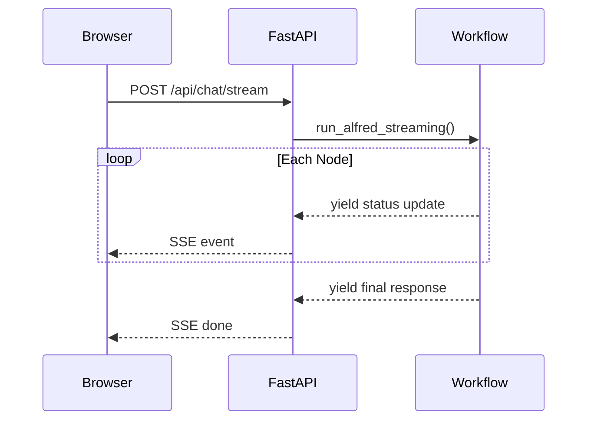

# Phase 10: Web Polish & Deployment

## Overview

Three features to make Alfred shareable:

1. Deploy to Railway with secure API keys
2. Add UI tabs for all database tables
3. Stream step progress to the UI

---

## 1. Railway Deployment

### Current State

- FastAPI app in [`src/alfred/web/app.py`](src/alfred/web/app.py)
- Runs locally via `alfred serve --port 8081`
- API keys in `.env` (not committed)

### Deployment Steps

**1.1 Add `Procfile` or Railway config:**

```javascript
web: uvicorn alfred.web.app:app --host 0.0.0.0 --port $PORT
```

**1.2 Set Railway environment variables:**

- `OPENAI_API_KEY`
- `SUPABASE_URL`
- `SUPABASE_KEY`
- `LANGSMITH_API_KEY` (optional)

**1.3 Ensure `pyproject.toml` dependencies are complete** (already done)**1.4 Login screen tweak:**

- Keep email hints visible (so friends can copy/paste)
- Remove password hint (`alfred123`) from UI display
- Password stays `alfred123` in DB, just not shown on screen

---

## 2. UI for All Tables

### Current Tabs

- Inventory
- Recipes  
- Shopping List

### Tables to Add

| Table | Tab Name | Key Columns to Display ||-------|----------|------------------------|| `meal_plans` | Meal Plan | date, meal_type, recipe name, notes || `tasks` | Tasks | title, due_date, category, completed || `cooking_log` | History | recipe name, cooked_at, rating, notes || `preferences` | Preferences | dietary, allergies, household_size, equipment |

### Implementation

Add to [`src/alfred/web/app.py`](src/alfred/web/app.py):

```python
@app.get("/api/tables/meal_plans")
@app.get("/api/tables/tasks")
@app.get("/api/tables/cooking_log")
@app.get("/api/tables/preferences")
```

Update `get_frontend_html()` to include new tabs in the UI.---

## 3. Streaming Step Progress

### Current Flow

```javascript
User sends message → "Alfred is thinking..." → Complete response
```


### Target Flow

```javascript
User sends message →
  "Planning..." →
  "Step 1/4: Reading inventory..." →
  "Step 2/4: Reading recipes..." →
  "Step 3/4: Analyzing matches..." →
  "Step 4/4: Adding to shopping list..." →
  Final response
```


### Architecture




### Implementation

**3.1 Modify workflow** [`src/alfred/graph/workflow.py`](src/alfred/graph/workflow.py):

- Add `run_alfred_streaming()` that yields intermediate states
- Use LangGraph's streaming capability or manual event emission

**3.2 Add SSE endpoint** in [`src/alfred/web/app.py`](src/alfred/web/app.py):

```python
from sse_starlette.sse import EventSourceResponse

@app.post("/api/chat/stream")
async def chat_stream(req: ChatRequest):
    async def event_generator():
        async for update in run_alfred_streaming(...):
            yield {"event": "step", "data": json.dumps(update)}
        yield {"event": "done", "data": ""}
    return EventSourceResponse(event_generator())
```

**3.3 Update frontend JavaScript:**

- Use `EventSource` or `fetch` with readable stream
- Update UI progressively as events arrive

**3.4 Add dependency:**

```javascript
sse-starlette
```

---

## Files to Create/Modify

| File | Action ||------|--------|| `Procfile` | Create for Railway || `railway.json` | Create (optional, for config) || [`src/alfred/web/app.py`](src/alfred/web/app.py) | Add table endpoints, SSE endpoint, update frontend || [`src/alfred/graph/workflow.py`](src/alfred/graph/workflow.py) | Add streaming generator || `pyproject.toml` | Add `sse-starlette` dependency |---

## Deployment Checklist

- [ ] Push to Railway
- [ ] Set environment variables in Railway dashboard
- [ ] Test login with existing users