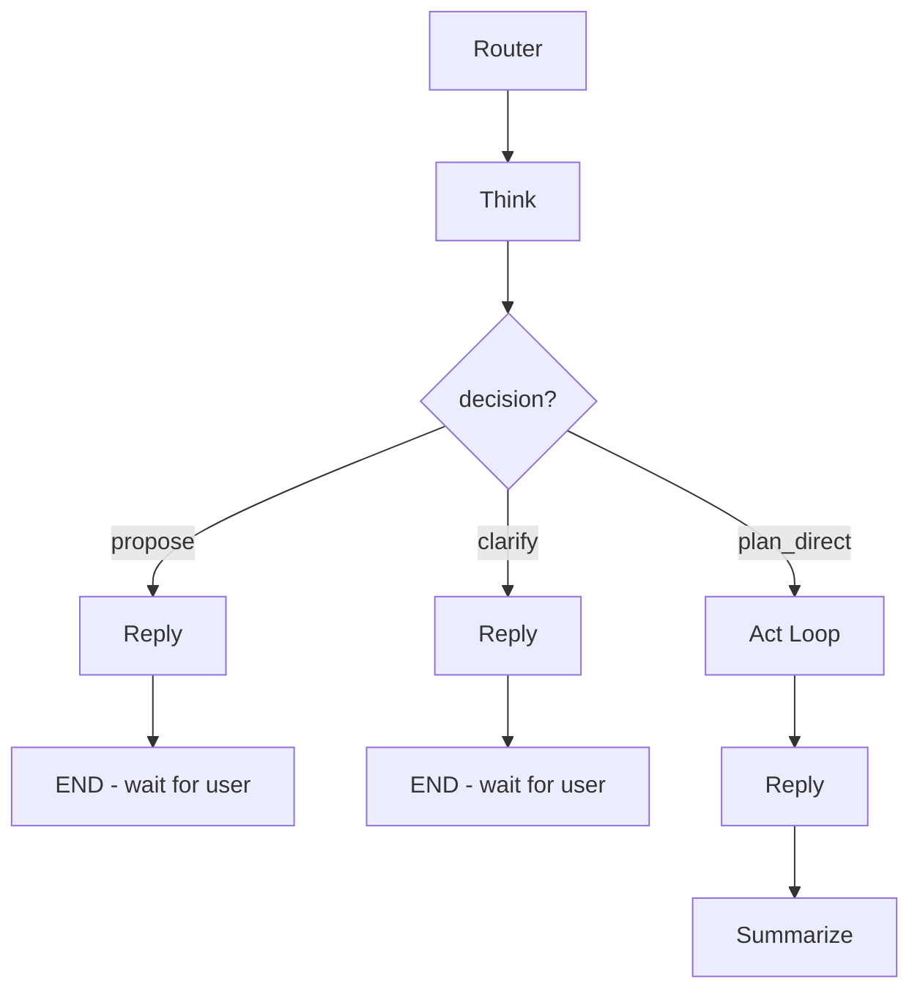

# Think Clarify/Propose Layer

## Goal

Enable Think to make smarter decisions about when to plan directly vs. when to pause for user confirmation or clarification.



---

## Phase 1: Data Dashboard for Think

Create a lightweight function that computes kitchen state counts (not raw data).**New function in [`src/alfred/background/profile_builder.py`](src/alfred/background/profile_builder.py):**

```python
@dataclass
class KitchenDashboard:
    inventory_count: int = 0
    inventory_by_location: dict[str, int]  # {"fridge": 12, "pantry": 30}
    recipe_count: int = 0
    recipes_by_cuisine: dict[str, int]  # {"Italian": 8, "Indian": 6}
    meal_plan_next_7_days: int = 0  # How many days have meals planned
    shopping_list_count: int = 0
    tasks_incomplete: int = 0

async def build_kitchen_dashboard(user_id: str) -> KitchenDashboard:
    # Simple COUNT queries against each table
```

**Format function:**

```python
def format_dashboard_for_prompt(dashboard: KitchenDashboard) -> str:
    """Returns compact markdown for Think prompt."""
```

---

## Phase 2: Think Output Model Changes

**Modify [`src/alfred/graph/state.py`](src/alfred/graph/state.py):**

```python
class ThinkOutput(BaseModel):
    # Decision (new)
    decision: Literal["plan_direct", "propose", "clarify"]
    
    # If plan_direct (existing behavior)
    goal: str
    steps: list[PlannedStep]
    
    # If propose (new) - state assumptions, let user confirm/correct
    proposal_message: str | None = None
    assumptions: list[str] | None = None
    
    # If clarify (new) - ask questions before planning
    clarification_questions: list[str] | None = None
```

---

## Phase 3: Think Node Changes

**Modify [`src/alfred/graph/nodes/think.py`](src/alfred/graph/nodes/think.py):**

1. **Inject user profile** (reuse `get_cached_profile`, `format_profile_for_prompt`)
2. **Inject kitchen dashboard** (new `build_kitchen_dashboard`, `format_dashboard_for_prompt`)
3. **Inject subdomain dependencies summary** (one-liner from SUBDOMAIN_SCOPE)

The prompt will include:

```markdown
## User Profile
- Constraints: vegetarian | Allergies: peanuts | Portions: 2
- Has: instant-pot, air-fryer | Skill: intermediate
- Planning: Weeknight quick meals, Batch cooking Sundays

## Kitchen At a Glance
- Inventory: 47 items (fridge: 12, pantry: 30, freezer: 5)
- Recipes: 23 saved (Italian: 8, Indian: 6, Other: 9)
- Meal Plan: 3 of next 7 days planned
- Shopping: 12 items | Tasks: 2 incomplete

## Domain Knowledge
- Meal plans need recipes (except prep/other types)
- Recipes include recipe_ingredients (linked table)
- Shopping is influenced by inventory, recipes, and meal plans
```

---

## Phase 4: Think Prompt Changes

**Modify [`prompts/think.md`](prompts/think.md):**

Add decision logic section:

```markdown
## When to Plan vs Propose vs Clarify

**Default to PROPOSE when you have user context.** Assume you know the user — their profile, routines, and preferences are your baseline. Only CLARIFY when data is truly missing.

| Signal | Decision | Example |
|--------|----------|---------|
| Simple read/write, clear intent | `plan_direct` | "What's in my pantry?" "Add eggs to shopping" |
| Complex request + have preferences | `propose` | "Plan my week" → "I'll plan 5 weeknight dinners, skip Wed (you eat out), Italian focus. Sound good?" |
| Complex request + empty preferences | `clarify` | "Plan my week" → "I'd like to learn your routine first. Busy nights? Cuisines you love?" |
| Request references missing data | `clarify` | "Use my saved recipes" but recipe_count=0 |
| Truly ambiguous intent | `clarify` | "Help me" (no context at all) |

### PROPOSE (the default for known users)
When you have profile/preferences/routines:
- State 2-4 assumptions based on what you know
- Frame as confirmation: "Here's my plan... Sound good?"
- User can confirm, correct, or add detail

### CLARIFY (only when context is missing)
When profile is empty OR critical data gaps exist:
- Ask 2-3 focused questions max
- Frame as learning: "I'd like to understand your routine..."
- This is onboarding/discovery, not the normal flow

### PLAN_DIRECT (simple, unambiguous)
When no confirmation needed:
- Simple CRUD (add, read, delete)
- Clear single-step operations
- No assumptions to validate
```

---

## Phase 5: Graph Routing Changes

**Modify [`src/alfred/graph/workflow.py`](src/alfred/graph/workflow.py):**Add conditional edge after Think:

```python
def route_after_think(state: AlfredState) -> str:
    think_output = state.get("think_output")
    if not think_output:
        return "reply"  # Error case
    
    match think_output.decision:
        case "plan_direct":
            return "act"
        case "propose" | "clarify":
            return "reply"  # Reply formats the proposal/questions
        case _:
            return "act"  # Fallback
```

Update graph edges:

```python
graph.add_conditional_edges(
    "think",
    route_after_think,
    {"act": "act", "reply": "reply"}
)
```

---

## Phase 6: Reply Node Changes

**Modify [`src/alfred/graph/nodes/reply.py`](src/alfred/graph/nodes/reply.py):**Handle propose/clarify modes:

```python
if think_output.decision == "propose":
    # Format assumptions nicely, ask for confirmation
    # e.g., "Here's what I'm thinking: [assumptions]. Sound good?"
    
elif think_output.decision == "clarify":
    # Format questions nicely
    # e.g., "Before I plan your week, a few questions: [questions]"
```

---

## Phase 7: Context Threading

**Modify [`src/alfred/graph/state.py`](src/alfred/graph/state.py):**Add to ConversationContext:

```python
pending_clarification: dict | None  # Tracks propose/clarify state
```

When user responds to proposal/clarification, next turn's Think sees the context and can now `plan_direct`.

---

## Decision Signals: How Think Knows What to Do

Think uses the **User Profile** and **Kitchen Dashboard** to decide:

| Signal | Source | Implies |

|--------|--------|---------|

| `profile.dietary_restrictions` not empty | UserProfile | User has set up preferences → PROPOSE ok |

| `profile.planning_rhythm` not empty | UserProfile | User has cooking routines → PROPOSE confidently |

| `dashboard.recipe_count > 0` | KitchenDashboard | User has recipes to reference |

| `dashboard.inventory_count > 0` | KitchenDashboard | User has pantry data |

| All profile fields empty | UserProfile | New user, needs onboarding → CLARIFY |

**Key insight:** The dashboard provides the "can I do this?" check. If user says "use my saved recipes" but `recipe_count=0`, Think knows to CLARIFY. If they say "plan my week" and we have preferences + recipes, Think PROPOSEs confidently.

---

## Files to Modify

| File | Changes |

|------|---------|

| [`src/alfred/background/profile_builder.py`](src/alfred/background/profile_builder.py) | Add `KitchenDashboard`, `build_kitchen_dashboard()`, `format_dashboard_for_prompt()` |

| [`src/alfred/graph/state.py`](src/alfred/graph/state.py) | Update `ThinkOutput` with decision, proposal_message, assumptions, clarification_questions |

| [`src/alfred/graph/nodes/think.py`](src/alfred/graph/nodes/think.py) | Inject profile, dashboard, subdomain deps; handle new output format |

| [`prompts/think.md`](prompts/think.md) | Add decision logic section, update output contract |

| [`src/alfred/graph/workflow.py`](src/alfred/graph/workflow.py) | Add conditional routing after Think |

| [`src/alfred/graph/nodes/reply.py`](src/alfred/graph/nodes/reply.py) | Handle propose/clarify response formatting |---

## Testing Scenarios

| Scenario | Has Preferences? | Expected Decision |

|----------|------------------|-------------------|

| "What's in my pantry?" | Any | `plan_direct` |

| "Add eggs to shopping" | Any | `plan_direct` |

| "Make me a recipe" | Yes | `propose` — "Quick weeknight meal for 2, Italian-ish, using pantry. Sound good?" |

| "Make me a recipe" | No | `clarify` — "What kind of dish? Quick or fancy? Any cuisine preference?" |

| "Plan my meals for next week" | Yes | `propose` — "5 weeknight dinners, skip Wed (you eat out), balance of Italian and Indian. Good?" |

| "Plan my meals for next week" | No | `clarify` — "I'd like to learn your routine. Busy nights? Favorite cuisines?" |

| "Use my saved recipes" | recipe_count=0 | `clarify` — "You don't have any saved recipes yet. Want me to suggest some?" |

| "Help me with dinner" | Any | `clarify` — "Are you cooking now or planning ahead?" |

| Post-clarification response | N/A | `plan_direct` — user answered, now we have context |